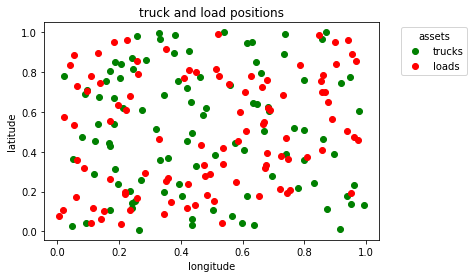
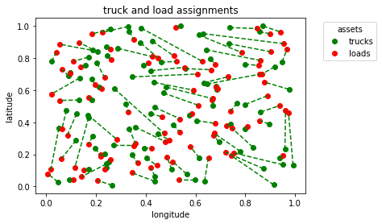

# Assignment Problem 

The assignment problem arises in a number of different industries. The most prominent is assigning Long Haul Trucks to their Loads. 
This project is heavily influenced by "A Stochastic Formulation of the Dynamic Assignment Problem, with an Application to Truckload Motor Carriers" by Warren B. Powell (Princton University 1996)

# Setup 

- install pipenv  
```
pip install pipenv
```

- install all dependencies via pipenv
```
pipenv install
```
- choose the kernel named "truck_assignment_*" for the jupyter notebook 

# Truck Assignment

The algorithm assigns trucks to loads depending on their haversine distance to those Loads. 
We want to minimize the distance between the truck/load pairs

- Truck and Load Positions  


- Assignments

